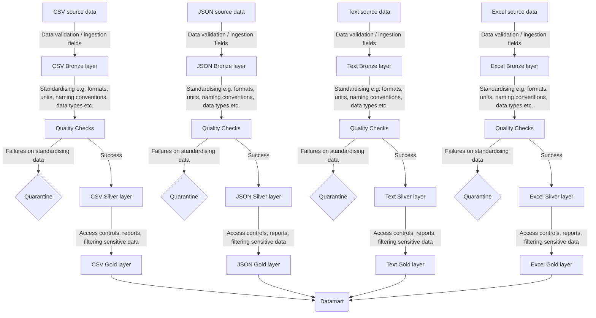

# Pipeline Architecture Diagram
# Flowchart

```mermaid
flowchart TD
    CSV[CSV source data] --> |Data validation / ingestion fields| CSVBronze[CSV Bronze layer]
    CSVBronze --> |Standardising e.g. formats, units, naming conventions, data types etc.| CSVQC[Quality Checks]
    CSVQC --> |Failures on standardising data| CSVQuar{Quarantine}
    CSVQC --> |Success| CSVSilver[CSV Silver layer]
    CSVSilver --> |Access controls, reports, filtering sensitive data| CSVGold[CSV Gold layer]

    JSON[JSON source data] --> |Data validation / ingestion fields| JSONBronze[JSON Bronze layer]
    JSONBronze --> |Standardising e.g. formats, units, naming conventions, data types etc.| JSONQC[Quality Checks]
    JSONQC --> |Failures on standardising data| JSONQuar{Quarantine}
    JSONQC --> |Success| JSONSilver[JSON Silver layer]
    JSONSilver --> |Access controls, reports, filtering sensitive data| JSONGold[JSON Gold layer]

    Text[Text source data] --> |Data validation / ingestion fields| TextBronze[Text Bronze layer]
    TextBronze --> |Standardising e.g. formats, units, naming conventions, data types etc.| TextQC[Quality Checks]
    TextQC --> |Failures on standardising data| TextQuar{Quarantine}
    TextQC --> |Success| TextSilver[Text Silver layer]
    TextSilver --> |Access controls, reports, filtering sensitive data| TextGold[Text Gold layer]

    Excel[Excel source data] --> |Data validation / ingestion fields| ExcelBronze[Excel Bronze layer]
    ExcelBronze --> |Standardising e.g. formats, units, naming conventions, data types etc.| ExcelQC[Quality Checks]
    ExcelQC --> |Failures on standardising data| ExcelQuar{Quarantine}
    ExcelQC --> |Success| ExcelSilver[Excel Silver layer]
    ExcelSilver --> |Access controls, reports, filtering sensitive data| ExcelGold[Excel Gold layer]

    CSVGold --> Datamart(Datamart)
    JSONGold --> Datamart(Datamart)
    TextGold --> Datamart(Datamart)
    ExcelGold --> Datamart(Datamart)
```
